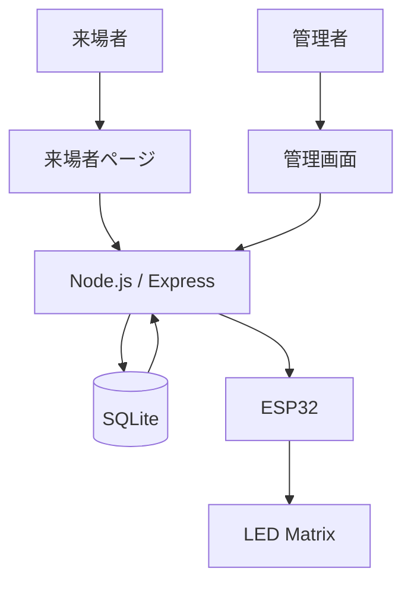

# LED Dot Canvas

## 概要

スマートフォンからドット絵を投稿し、
ESP32でLEDマトリクスへ表示する学園祭向けシステムです。

## システム構成



## フォルダ構成

```text
LED-Dot-Canvas/
├── index.html          # 来場者画面
├── app.js              # 来場者画面の処理
├── admin.js            # 管理画面の処理
├── server.js           # Node.jsサーバー
├── package.json        # Node.js設定
├── package-lock.json
├── README.md
│
├── Arduino/
│   └── test01.ino      # ESP32プログラム
│
└── images/
    └── system.png      # （今後追加予定）
```

## 使用技術

- HTML
- CSS
- JavaScript
- Node.js
- Express
- SQLite
- ESP32
- Arduino

## 機能

- ドット絵作成
- ニックネーム投稿
- SQLite保存
- 管理画面
- プレビュー
- ピン留め
- スライドショー
- ESP32表示
