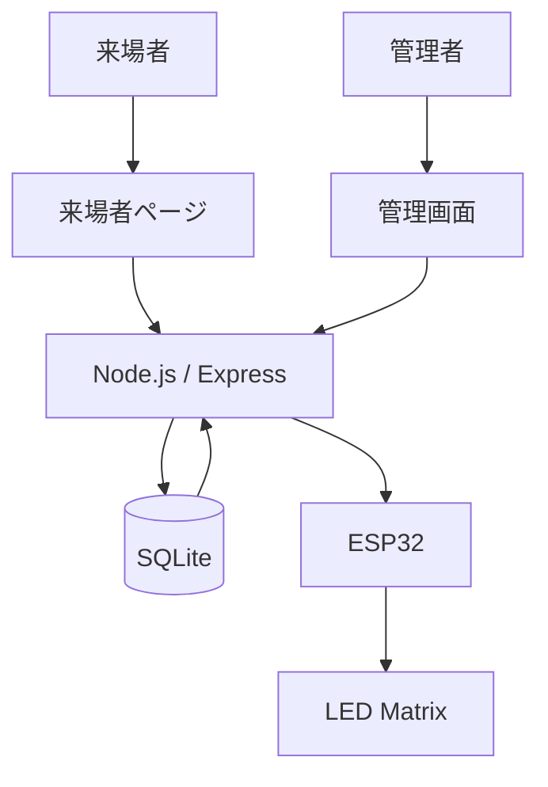

# LED Dot Canvas

## 概要

スマートフォンからドット絵を投稿し、
ESP32でLEDマトリクスへ表示する学園祭向けシステムです。

## システム構成


```mermaid
flowchart TD
    User[来場者]
    Admin[管理者]
    Front[来場者ページ]
    Dashboard[管理画面]
    API[Node.js / Express]
    DB[(SQLite)]
    ESP[ESP32]
    LED[LED Matrix]

    User --> Front
    Front --> API

    Admin --> Dashboard
    Dashboard --> API

    API --> DB
    DB --> API

    API --> ESP
    ESP --> LED
```

## フォルダ構成

```text
LED-Dot-Canvas/
├── index.html          # 来場者画面
├── app.js              # 来場者画面の処理
├── style.css           # 来場者画面のスタイル
├── admin.html          # 管理画面
├── admin.js            # 管理画面の処理
├── admin.css           # 管理画面のスタイル
├── server.js           # Node.jsサーバー
├── package.json        # Node.js設定
├── package-lock.json
├── README.md
├── LICENSE             # ライセンス（MIT）
├── SECURITY.md
│
├── esp32/
│   └── test01/
│       └── test01.ino  # ESP32プログラム
│
└── images/
    └── system.png      # （今後追加予定）
```

## 使用技術

- HTML
- CSS
- JavaScript
- Node.js
- Express
- SQLite
- ESP32
- Arduino

## 機能

- ドット絵作成
- ニックネーム投稿
- SQLite保存
- 管理画面
- プレビュー
- ピン留め
- スライドショー
- ESP32表示

## ライセンス

[MIT License](./LICENSE) のもとで公開しています。
学園祭・文化祭・学校行事・個人利用など、用途を問わず自由に使用・改変・再配布できます。

### 一声かけていただけると嬉しいです

使っていただいたときは、一声かけていただけると嬉しいです。
「使いました」の一言だけで十分です。励みになります。

連絡先：このリポジトリの [Issues](https://github.com/Amemiyakana890/LED-Dot-Canvas/issues) に書き込んでいただくか、
GitHub（[Amemiyakana890](https://github.com/Amemiyakana890)）までお願いします。

※ これはお願いであり、ライセンスの条件ではありません。連絡がなくても自由に使えます。
